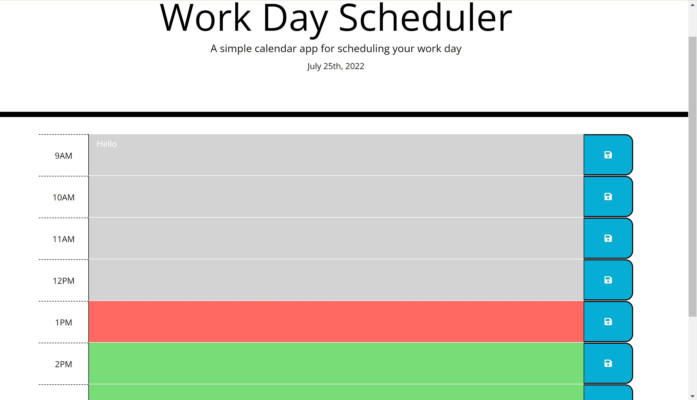
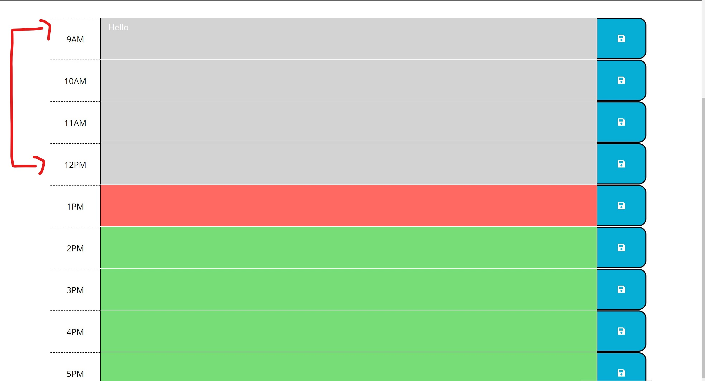
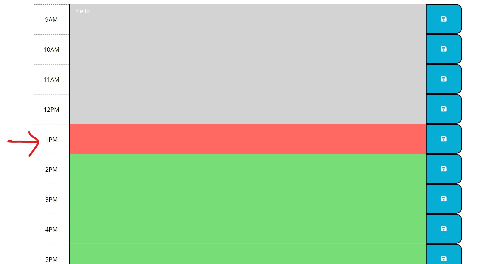
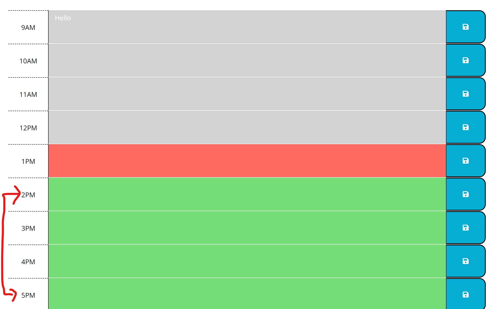

# Day-Planner
### Deployed Link:

## Module 5 Challenge

- ### This project was given a starter code using the Moment.js
- ### The <b>user story</b> wanted to add important events to daily planner.
- ### When users enter an event and click save button, the text for that event is saved in local storage.
- ### Each time blocks is color-coded, whether is in the past, present or future. 

### <b>Day Planner</b>

### <b>Past</b> color-coded is <b>grey</b>:

### <b>Present</b> color-coded is <b>red</b>

### <b>Future</b> color-coded is <b>green</b>
